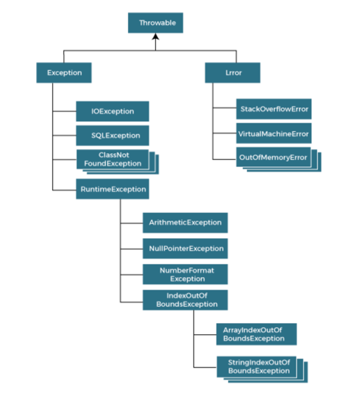
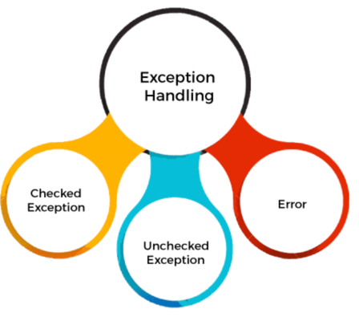
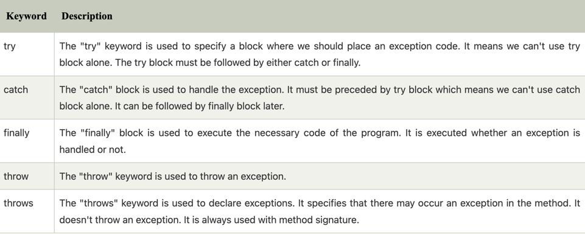
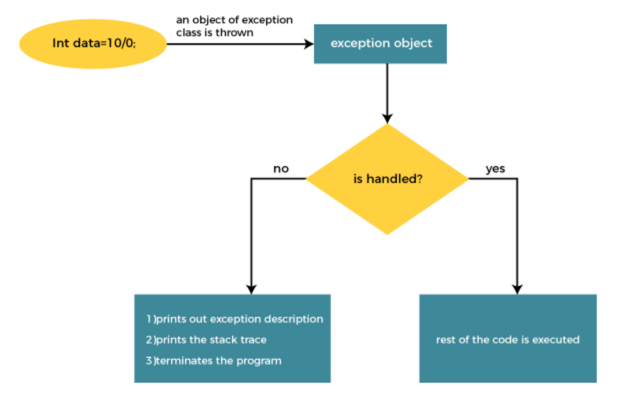

**Exception Handling in java**

```text

the exception handling in java is one of the powerful mechanism to handle the runtime errors so that
the normal flow of the application can be maintained

in the tutorial, we will learn about the java exceptions, it's types and the differences between checked and unchecked 
exceptions

```

**what is exception in java ?**

```text

Dictionary Meaning: Exception is an abnormal condition

in java, an exception is an event that disrupts the normal flow of the program. it is an object which is thrown at runtime.

```


**what is Exception Handling ?**

```text

Exception Handling is a mechanism to handle runtime errors such as ClassNotFoundException, IOException,SQLException. etc

```

```text

Advantage of Exception Handling

the core advantage of exception handling is to maintain the normal flow of the application. an exception normally

disrupts the normal flow of the application; that is why we need to handle exceptions. let's consider a scenario;

statement 1;  
statement 2;  
statement 3;  
statement 4;  
statement 5;//exception occurs  
statement 6;  
statement 7;  
statement 8;  
statement 9;  
statement 10;  

```

Suppose there are 10 statements in java program and an exception occurs at statements 5; the rest of the code will

not be executed, i.e: statements 6 to 10 will not be executed, However, when we perform exception handling, the rest of

the statements will be executed that is why we use exception handling in java.


```text

do you know ?

- what is the difference between checked and unchecked exceptions ?
- what happens behind the code int data=50/0?
- why use multiple catch block ?
- is there any possibility when the finally block is not executed ?
- what is exception propagation ?
- what is the difference between the throw and throws keyword ?
- what are the 4 rules for using exception handling with method overriding ?

```

**Hierarchy of java Exception classes**

```text

the java.lang.Throwable class is the root class of java Exception hierarchy inherited by two subclasses: Exception and Error.
the hierarchy of java Exception classes is given below:

```



**Types of java Exceptions**

```text

there are mainly two types of exceptions: checked and unchecked, an error is considered as the  unchecked exception.

however according to  Oracle, there are three types of exceptions namely:

- checked Exception
- Unchecked Exception
- Error

```



**Difference between Checked and Unchecked Exceptions**

1： checked Exception

```text

The classes that directly inherit the Throwable class except RuntimeException and Error are known as checked exceptions. 
For example, IOException, SQLException, etc. Checked exceptions are checked at compile-time.

```

2: Unchecked Exception

```text

The classes that inherit the RuntimeException are known as unchecked exceptions. 
For example, ArithmeticException, NullPointerException, ArrayIndexOutOfBoundsException, etc. 
Unchecked exceptions are not checked at compile-time, but they are checked at runtime

```

3: Error

```text

Error is irrecoverable. Some example of errors are OutOfMemoryError, VirtualMachineError, AssertionError etc.

```

**java Exception keywords**

Java provides five keywords that are used to handle the exception. The following table describes each.




**java try-catch block**

Java try block is used to enclose the code that might throw an exception. It must be used within the method.

If an exception occurs at the particular statement in the try block, the rest of the block code will not execute. 
So, it is recommended not to keep the code in try block that will not throw an exception.

Java try block must be followed by either catch or finally block.

```text

try{    
//code that may throw an exception    
}catch(Exception_class_Name ref){}   

try{    
//code that may throw an exception    
}finally{}    

```

**java catch block**

java catch block is used to handle the Exception by declaring the type of exception within the parameter

The declared exception must be the parent class exception ( i.e., Exception) or the generated exception type. 
However, the good approach is to declare the generated type of exception.

The catch block must be used after the try block only. You can use multiple catch block with a single try block.

**Internal(n: 本质， 内脏) Working of Java try-catch block**



```text

the jvm firstly checks whether the exception is handled or not. if exception is not handled, jvm provides a default
exception handler that performs the following tasks:

- Prints out exception description
- Prints the stack trace（hierarchy of methods where the exception occurred）
- Causes the program to terminate

But if the application programmer handles the exception, the normal flow of the application is maintained, i.e., rest of the code is executed.

```