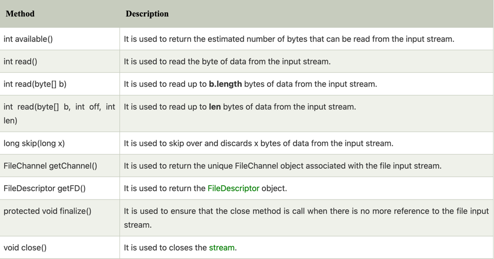

**Java FileInputStream Class**

```text

Java FileInputStream class obtains input bytes from a file. 
It is used for reading byte-oriented data (streams of raw bytes) such as image data, audio, video etc. 
You can also read character-stream data. But, for reading streams of characters, it is recommended to use FileReader class.

```

***java FileInputStream class declaration***

```java

public class FileInputStream extends InputStream

```

**Java FileInputStream class methods**

