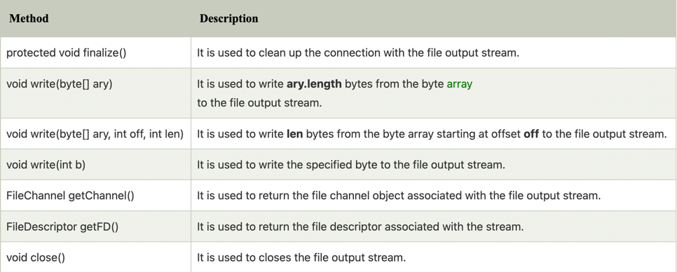

**Java FileOutputStream Class**

Java FileOutputStream is an output stream used for writing data to a file

```text

If you have to write primitive values into a file, use FileOutputStream class. 
You can write byte-oriented as well as character-oriented data through FileOutputStream class. 
But, for character-oriented data, it is preferred to use FileWriter
than FileOutputStream.

```

**FileOutputStream class declaration**

Let's see the declaration for Java.io.FileOutputStream class:

```text

public class FileOutputStream extends OutputStream 

```

**FileOutputStream class methods**

