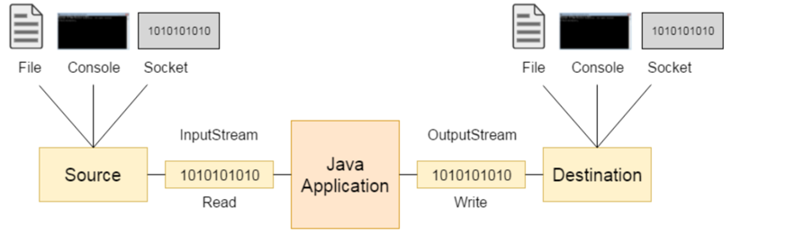
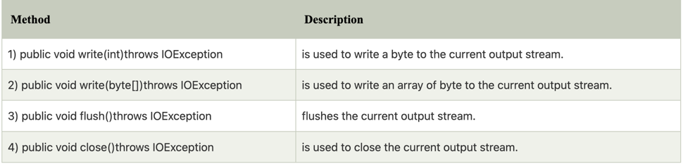
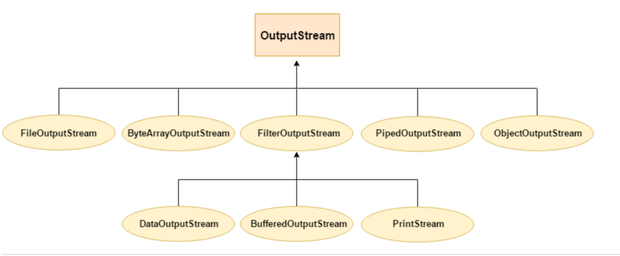
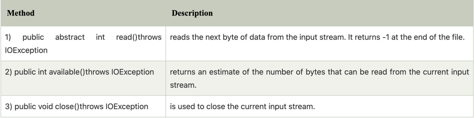
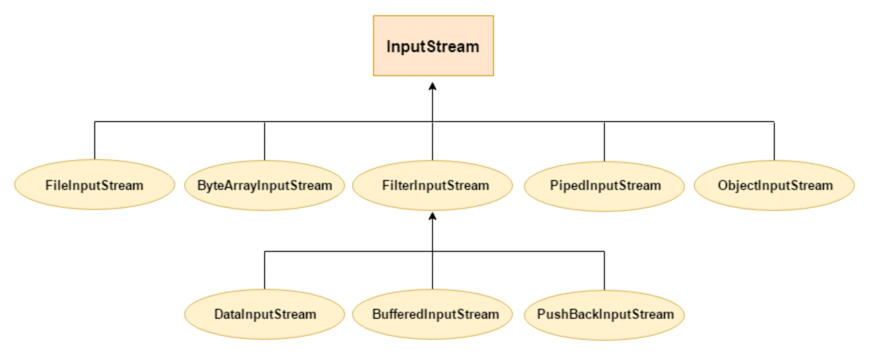

**java i/o tutorial**

```text

Java I/O is used to process the input and produce the output.

Java uses the concepts of a stream to make I/O operation fast, the java.io package contains all the classes required for 
input and output operations

we can perform file handling in java by java i/o api

```

**Stream**

```text

a stream is a sequence of data. in java. a stream is composed of bytes. it's called a stream because it is like a

stream of water that continues to flow.

```

in java. 3 streams are created for us automatically, all these streams are attached with console。

- System.out: standard output stream
- System.in : standard output stream
- System.err: standard output stream

let's see the code to print output and an error message to the console

```text

System.out.println("simple message");  
System.err.println("error message");  

```

let's see the code to get input from console

```text

int i=System.in.read();//returns ASCII code of 1st character  
System.out.println((char)i);//will print the character  

```

**do you know ? (some questions)**

```text

- How to write a common data to multiple files using a single stream only?
- How can we access multiple files by a single stream?
- How can we improve the performance of Input and Output operation?
- How many ways can we read data from the keyboard?
- What does the console class?
- How to compress and uncompress the data of a file?

```

**OutputStream vs InputStream**

the explanation of OutputStream and InputStream classes are given blow:

***OutputStream***

Java application uses an output stream to write data to a destination; it may be a file, an array, peripheral device or socket.

***InputStream***

```text

Java application uses an input stream to read data from a source; it may be a file, an array, peripheral device or socket.

Let's understand the working of Java OutputStream and InputStream by the figure given below.


```



**OutputStream class**

```text
OutputStream class is an abstract class. It is the superclass of all classes representing an output stream of bytes. 
An output stream accepts output bytes and sends them to some sink.

```
**Useful methods of OutputStream**



**OutputStream Hierarchy**



**InputStream class**

InputStream class is an abstract class. It is the superclass of all classes representing an input stream of bytes.

**Useful methods**



**InputStream Hierarchy**

