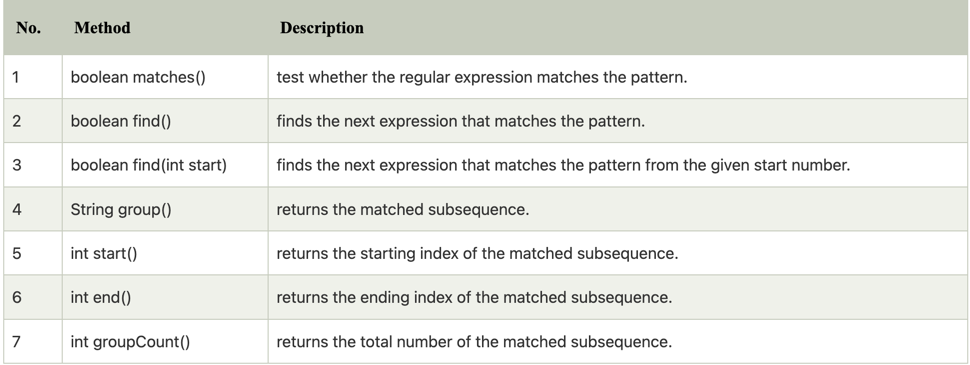
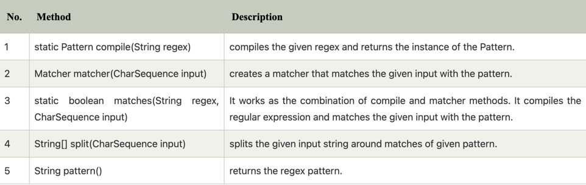

***Java Regex***

```text

the java Regex or Regular expression is an api to define a patten fo searching or manipulating strings.
It is widely used to define the constraint on strings such as password and email validation. After learning Java regex tutorial, 
you will be able to test your regular expressions by the Java Regex Tester Tool.
Java Regex API provides 1 interface and 3 classes in java.util.regex package.

java.util.regex package

The Matcher and Pattern classes provide the facility of Java regular expression. 
The java.util.regex package provides following classes and interfaces for regular expressions.

```

- MatchResult interface
- Matcher class
- Pattern class
- PatternSyntaxException class

**Matcher Class**

It implements the MatchResult interface. It is a regex engine which is used to perform match operations on a character sequence.



**Pattern class**

It is the compiled version of a regular expression. It is used to define a pattern for the regex engine.



