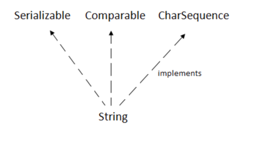
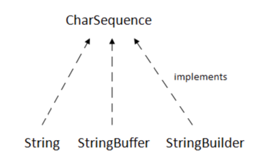
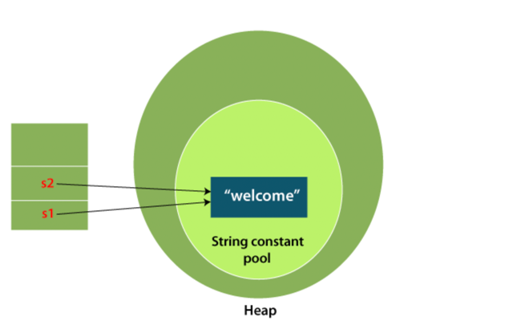
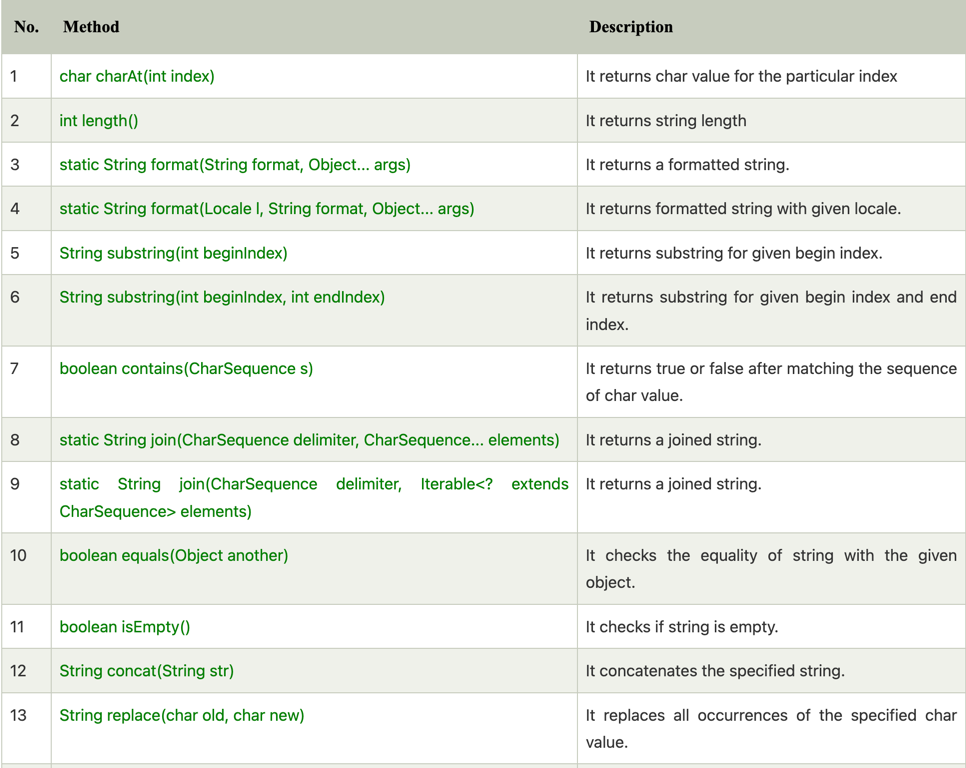
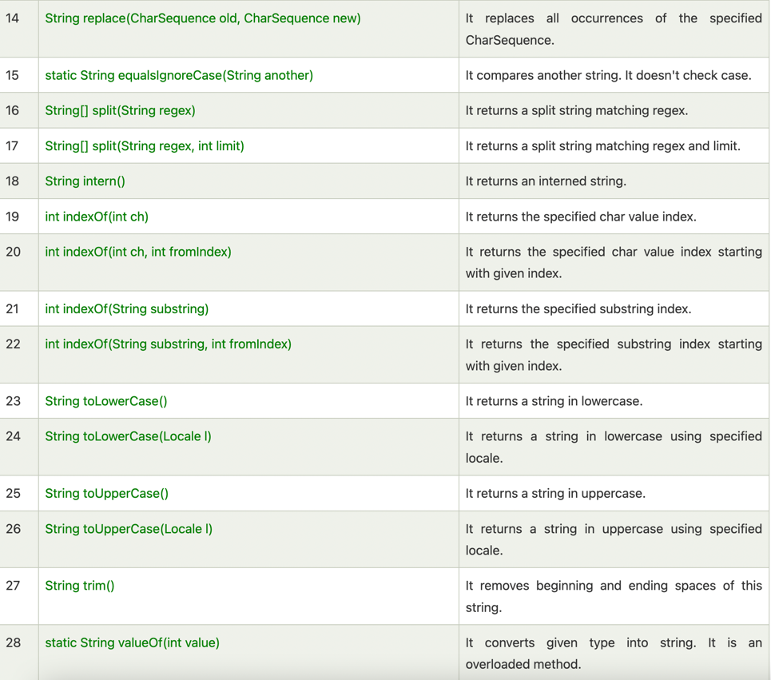

**java string**

````text

in java string is basically an object that represents sequence of char values
for example

char[] ch={'j','a','v','a','t','p','o','i','n','t'};  
String s=new String(ch);  

is same as:

String s="javatpoint";  

````

```text

java string class also provides a lot of methods to perform operations on strings such as compare()
concat(), equal(), split(), length(), replace(), compareTo(), intern(), substring(), etc.


the java.lang.String class implements Serializable, comparable and CharSequence interfaces.

```



**CharSequence interfaces**

```text

The CharSequence interface is used to represent the sequence of characters. String, StringBuffer and StringBuilder classes implement it.
It means, we can create strings in Java by using these three classes.

```



```text

The Java String is immutable which means it cannot be changed. Whenever we change any string, a new instance is created.
For mutable strings, you can use StringBuffer and StringBuilder classes.
We will discuss immutable string later. Let's first understand what String in Java is and how to create the String object.

```

**what is String in java ?**

```text

Generally, String is a sequence of characters, But in java, string is an object that represents s sequence of characters.

the java.lang.String class is used to create a string object.

there are two ways to create String object:
1: by string literal
2: by new keyword

```

**String Literal**

java string literal is created by using double quotes. for example:

```java

String name="arthur";

```

Each time you create a string literal, the JVM checks the "string constant pool" first. if the string already exist in the pool,
a reference to the pooled instance is returned, if the string doesn't exist in the pool, a new string instance is created and
placed in the pool. for example:

```java

String name="arthur";
Stirng name2="arthur"; // it doesn't create a new instance

```



```text

In the above example, only one object will be created. 
Firstly, JVM will not find any string object with the value "Welcome" in string constant pool that is why it will create a new object. 
After that it will find the string with the value "Welcome" in the pool, 
it will not create a new object but will return the reference to the same instance.

```

note: String objects are stored in a special memory area known as the "string constant pool".

**By new Keyword**

```text

String s=new String("Welcome");

```

```text

in such case, JVM will create a new string in normal(non-pool) heap memory. and the literal "welcome" will be placed in the string 
constant pool, the variable's will refer to the object in a heap(non-pool)

```

The java.lang.String class provides many useful methods to perform operations on sequence of char values.






