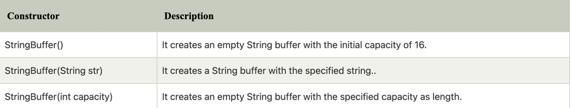
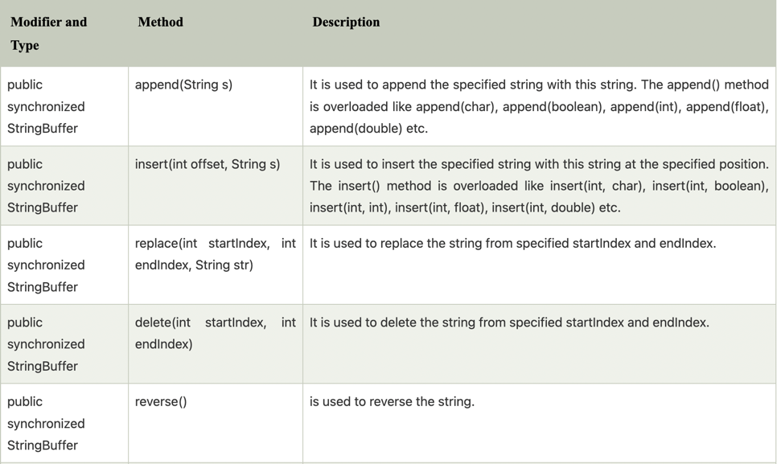
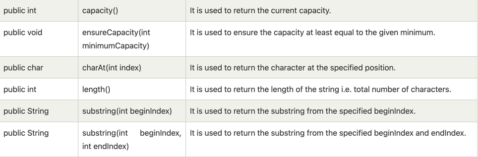
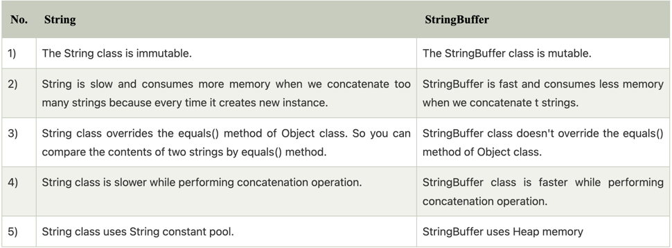
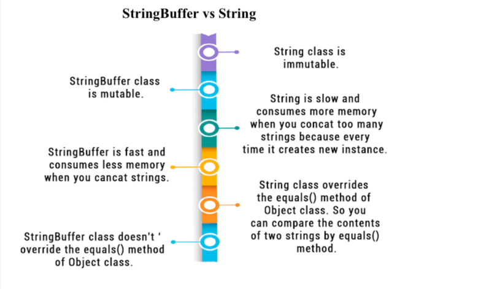

***java StringBuffer Class***

```text

java StringBuffer class is used to create mutable String object. the StringBuffer class in jva is the same as String
class except it is mutable. i.e it can be changed

```

Note: java StringBuffer class is thread-safe i.e. multiple threads cannot assess it simultaneously. so it is safe and 
will result in an order.

**importance of Constructors of StringBuffer Class**



**important methods of StringBuffer class**




***what is mutable String ?***

```text

a String that can be modified or changed is known as mutable String. StringBuffer and StringBuffer classes are used
for creating mutable strings

```

***difference between String and StringBuffer***

```text

there are many differences between String and StringBuffer  a list of differences String and StringBuffer are given below

```



