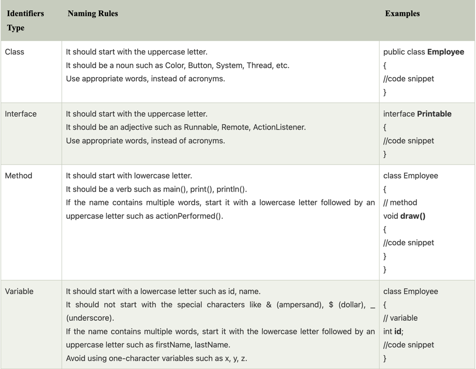
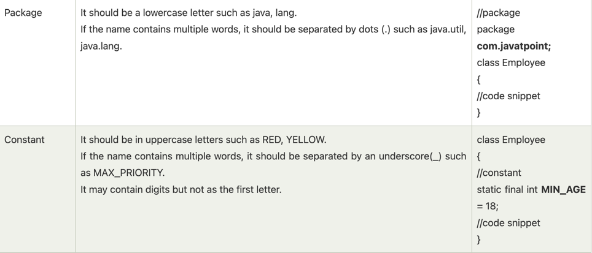

**Naming convention**

```text

Java naming convention is a rule to follow as you decide what to name your identifiers such as class, package, variable, constant, method, etc.
But, it is not forced to follow. So, it is known as convention not rule. These conventions are suggested by several Java communities such as Sun Microsystems and Netscape.
All the classes, interfaces, packages, methods and fields of Java programming language are given according to the Java naming convention. If you fail to follow these conventions, 
it may generate confusion or erroneous code.

```

***Advantage of Naming Conventions in Java***

```text

By using standard Java naming conventions, you make your code easier to read for yourself and other programmers.
Readability of Java program is very important. It indicates that less time is spent to figure out what the code does.

```

***Naming Conventions of the Different Identifiers***




***CamelCase in Java naming conventions***

```text

Java follows camel-case syntax for naming the class, interface, method, and variable.
If the name is combined with two words, the second word will start with uppercase letter always such as actionPerformed(), 
firstName, ActionEvent, ActionListener, etc.

```