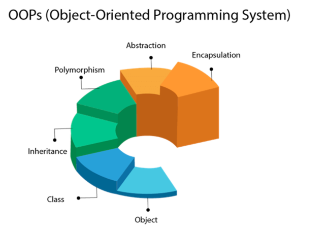

***About oops!***

```text

The main aim of object-oriented programming is to implement real-world entities, for example, 
object, classes, abstraction, inheritance, polymorphism, etc.

```

**OOPs (Object-Oriented Programming System)** 

```text

Object means a real-world entity such as a pen, chair, table, computer, watch, etc. 
Object-Oriented Programming is a methodology or paradigm to design a program using classes and objects. 
It simplifies software development and maintenance by providing some concepts:

```

- Object
- Class
- inheritance
- Polymorphism
- abstraction
- Encapsulation

Apart from these concepts, there are some other terms which are used in Object-Oriented design:

- Coupling
- Cohesion
- Association
- Aggregation
- Composition




**Object**

```text

Any entity that has state and behavior is known as an object. For example, a chair, pen, table, keyboard, bike, etc.
 It can be physical or logical.
An Object can be defined as an instance of a class. An object contains an address and takes up some space in memory. 
Objects can communicate without knowing the details of each other's data or code. The only necessary thing is the type of message accepted and the type of response returned by the objects.
Example: A dog is an object because it has states like color, name, breed, etc. as well as behaviors like wagging the tail, barking, eating, etc

```

**Class**

```text

Collection of objects is called class. It is a logical entity.
A class can also be defined as a blueprint from which you can create an individual object. Class doesn't consume any space.

```

**Inheritance**

```text

If one task is performed in different ways, it is known as polymorphism. For example: to convince the customer differently, 
to draw something, for example, shape, triangle, rectangle, etc.

In Java, we use method overloading and method overriding to achieve polymorphism.
Another example can be to speak something; for example, a cat speaks meow, dog barks woof, etc.

```


**Abstraction**

```text

Hiding internal details and showing functionality is known as abstraction. For example phone call, we don't know the internal processing.
In Java, we use abstract class and interface to achieve abstraction.

```


**encapsulation**

```text

Binding (or wrapping) code and data together into a single unit are known as encapsulation. 
For example, a capsule, it is wrapped with different medicines.

A java class is the example of encapsulation. Java bean is the fully encapsulated class because all the data members are private here.

```


**Coupling**

```text

Coupling refers to the knowledge or information or dependency of another class. It arises when classes are aware of each other. 
If a class has the details information of another class, there is strong coupling. In Java, we use private, protected,
and public modifiers to display the visibility level of a class, method, and field. 
You can use interfaces for the weaker coupling because there is no concrete implementation.

```

**Cohesion**

```text

Cohesion refers to the level of a component which performs a single well-defined task. 
A single well-defined task is done by a highly cohesive method. 
The weakly cohesive method will split the task into separate parts. 
The java.io package is a highly cohesive package because it has I/O related classes and interface. 
However, the java.util package is a weakly cohesive package because it has unrelated classes and interfaces.

```


